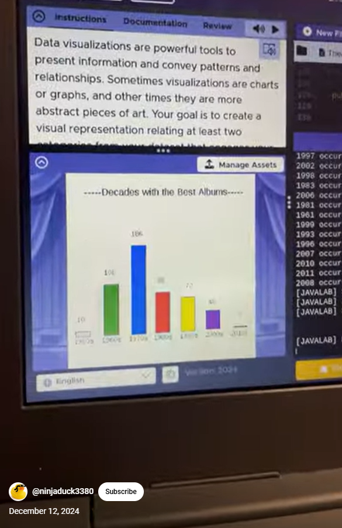

# Abstract-Data-Art-Project
# Unit 4 - Abstract Art Project

## Introduction

Data visualizations are powerful tools to present information and convey patterns and relationships. Sometimes visualizations are charts or graphs, and other times they are more abstract pieces of art. Your goal is to create a visual representation relating at least two categories from your dataset that engages your viewer and encourages them to learn more about your chosen topic.

## Requirements

Use your knowledge of object-oriented programming, one-dimensional (1D) arrays, and algorithms to create your data visualization program:

- **Create at least two 1D arrays** – Create at least two 1D arrays to store the data that will make up your visualization.
- **Implement one or more algorithms** – Implement one or more algorithms that use two-way or multi-selection statements with compound Boolean expressions to analyze the data.
- **Use methods in the Math class** – Use one or more methods in the Math class in your program, such as to perform calculations on the values in your dataset and display the results, choose random values from the dataset, or display images or shapes at random locations.
- **Create a visualization** – Create an image or animation that conveys the story of the data by illustrating the patterns or relationships in the data.
  Note: This may be abstract! Others do not necessarily need to know what the story or pattern is right away, but you do need to be able to explain it to them.
- **Document your code** – Use comments to explain the purpose of the methods and code segments and note any preconditions and postconditions.

## Dataset

Include a hyperlink to the source of your dataset used for this project. Additionally, provide a short description of each column used from the dataset, and the data type.

Example:

Dataset: https://www.kaggle.com/datasets/sansuthi/global-co2-emissions

- **Country** (String) - name of the country
- **Population** (int) - number of people in the country
- **CO2Emissions** (double) - carbon dioxide emission in kilotons

## UML Diagram

## Video Demo

Record a short video of your abstract art animation to display here on your README. You can do this by:

- Screen record your project running on Code.org.
- Upload that recording to YouTube.
- Take a thumbnail for your image.
- Upload the thumbnail image to your repo.
- Use the following markdown

)

## Description

My project analyzes Rolling Stones top 500 Albums of all time, using the title, artist, genre, and year columms and turns them into text files. This project is meant to help someone find some Albums that they should listen too. I have two class the dataScene class, and the Album class. The Album class creates one Album object with the colums acting as the instance variables and being put into an Album object with the constructor. This can then be printed with the toString method in the console. The DataScene class has an album array and createAlbums method where it creates an Album array with its desires elemnts like title, artist, genre, and year. The DataScene class also has a findAlbumReleased method, findDecades method, random method, and a drawScene method. The findAlbumReleased method counts how many albums were realeased in each year. It does this by creating traversing the year text file and creating two new arrays, a uniqueYears array, which creates a new array with all of the different years that appear, and a counts array which counts how many albums were published in a unique year. The findDecades method is similar but it sorts how many albums were released in each decade. It traverses the year text file, and putting it through a long conditional statement where it checks if its greater than a specific decade and if its less than the next decade. The randomAlbums method uses the Math.random method to generate a random number that is in the albums[].length range and uses that numbe rto find the album that is at that index. The final method shows the randomAlbum method, and the findDecades method in the theater. I belive that my project can help someone find a random Album from the top 500 Albums of all time, aswell as seeing which decade, and year produced the best albums. 